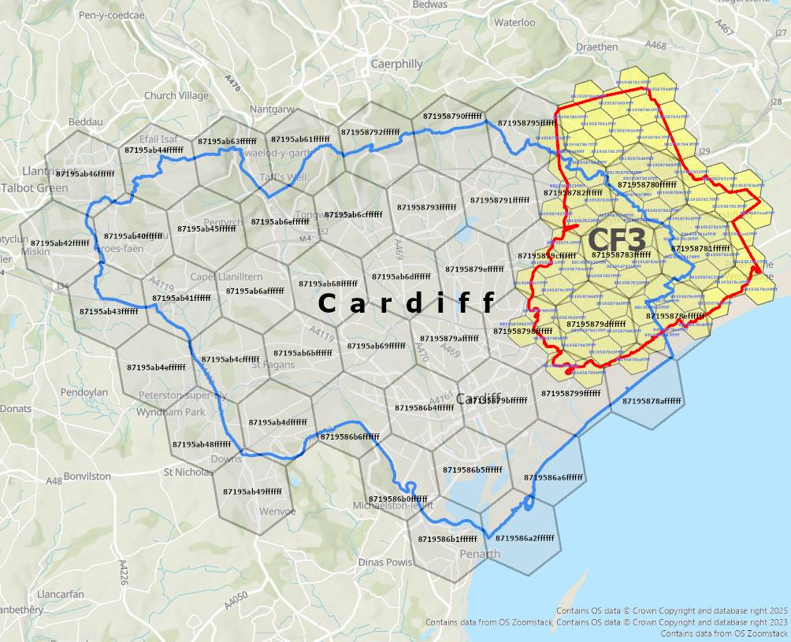

# Algorithm 2: Spatial Relationship Classification

This document provides the complete specification for classifying 17 qualitative spatial relationships between H3 cell sets representing features from heterogeneous geographic hierarchies, as described in Section 3.2 of the associated research paper.

## 1. Metric Logic

The degree of intersection between two H3 cell sets A and B is characterised by the **overlap ratio** ρ:

> ρ = |A ∩ B| / min(|A|, |B|),  where 0 ≤ ρ ≤ 1

Proximity between non-overlapping features at the same resolution is measured by the **minimum H3 grid distance**:

> d(A, B) = min { gridDistance(a, b) : a ∈ A, b ∈ B }

## 2. The 17 Spatial Relationships

### 2.1 Topological Relationships (Same Resolution)

| # | Relationship | Condition | Description |
|:---:|:---|:---|:---|
| 1 | **Identical** | A = B, res(A) = res(B) | Cell sets are equal |
| 2 | **Complete Containment** | A ⊂ B or B ⊂ A, A ≠ B, res(A) = res(B) | One set is a proper subset |
| 3 | **Touch** | \|A ∩ B\| > 0, ρ ≤ 0.05, **and** A ∩ B ⊆ border(A) ∩ border(B) | Shared cells on boundaries only |
| 4 | **Intersect** | \|A ∩ B\| > 0, ρ ≤ 0.10, res(A) = res(B) | Minimal overlap (≤ 10%) |
| 5 | **Overlap** | \|A ∩ B\| > 0, ρ > 0.10, res(A) = res(B) | Significant overlap (> 10%) |
| 6 | **Disjoint** | \|A ∩ B\| = 0, no adjacency, no hierarchical relationship | No spatial relation |

### 2.2 Proximity Relationships (Same Resolution, No Shared Cells)

| # | Relationship | Condition | Description |
|:---:|:---|:---|:---|
| 7 | **Neighbour** | d = 1 | Directly adjacent cells |
| 8 | **Close** | d = 2 | Separated by one cell ring |
| 9 | **Near** | d ∈ {3, 4} | Separated by two cell rings |
| 10 | **Far** | d > 4 | More than four cells apart |
| 11 | **Far Away** | d = −1 (undefined) | Disconnected H3 grid components |

### 2.3 Hierarchical Relationships (Different Resolutions)

These relationships use parent-mapping via `cellToParent` to elevate finer-resolution cells to the coarser resolution for comparison.

| # | Relationship | Condition | Description |
|:---:|:---|:---|:---|
| 12 | **Direct Parent, Complete** | parent(A, res(B)) ⊆ B, res(A) = res(B) + 1, geom_contain(A, B) | Finer unit fully within parent |
| 13 | **Direct Parent, Partial** | \|parent(A, res(B)) ∩ B\| > 0, ¬geom_contain(A, B), res(A) = res(B) + 1 | Finer unit partially overlaps parent |
| 14 | **Ancestor, Complete** | parent(A, res(B)) ⊆ B, res(A) > res(B) + 1, geom_contain(A, B) | Finer unit fully within ancestor |
| 15 | **Ancestor, Partial** | \|parent(A, res(B)) ∩ B\| > 0, ¬geom_contain(A, B), res(A) > res(B) + 1 | Finer unit partially overlaps ancestor |
| 16 | **Hierarchical Touch** | parent(A, res(B)) ∩ B ⊆ border(B) | Overlap limited to boundary of coarser unit |
| 17 | **Hierarchical Overlap** | parent(A, res(B)) ∩ B ⊄ border(B) | Overlap extends into interior of coarser unit |

## 3. Main Algorithm Pseudocode

```
ALGORITHM: Classify Spatial Relationship Between Two Features
─────────────────────────────────────────────────────────────

INPUT:  C_i, C_j    — H3 cell sets for features i and j
        r_i, r_j    — assigned H3 resolutions
        h_i, h_j    — hierarchy IDs
        l_i, l_j    — hierarchical levels

OUTPUT: Relationship label ∈ {Identical, Complete Containment, Touch,
        Intersect, Overlap, Neighbour, Close, Near, Far, Far Away,
        Direct Parent Complete, Direct Parent Partial,
        Ancestor Complete, Ancestor Partial,
        Hierarchical Touch, Hierarchical Overlap, Disjoint}

  1   C_i ← SET(C_i);  C_j ← SET(C_j)
  2   IF C_i = ∅ OR C_j = ∅ THEN RETURN "Error: Not Valid"

      // ── SAME RESOLUTION ──
  3   IF r_i = r_j THEN
  4       IF C_i ⊂ C_j AND C_i ≠ C_j THEN RETURN "Complete Containment"
  5       IF C_j ⊂ C_i AND C_j ≠ C_i THEN RETURN "Complete Containment"
  6       IF C_i = C_j THEN RETURN "Identical"
  7       S ← C_i ∩ C_j                              // shared cells
  8       IF S ≠ ∅ THEN
  9           IF |S| / min(|C_i|, |C_j|) ≤ 0.05
                 AND ARE_SHARED_CELLS_ON_BOUNDARY(C_i, C_j, S) THEN
 10               RETURN "Touch"
 11           ELSE
 12               ρ ← |S| / min(|C_i|, |C_j|)        // overlap ratio
 13               IF ρ ≤ 0.10 THEN RETURN "Intersect"
 14               ELSE RETURN "Overlap"
 15           END IF
 16       END IF
 17       IF ADJACENT_CELLS(C_i, C_j) THEN RETURN "Neighbour"
 18       d ← min{ gridDistance(a, b) : a ∈ C_i, b ∈ C_j }
 19       IF d = 2 THEN RETURN "Close"
 20       ELSE IF d ∈ {3, 4} THEN RETURN "Near"
 21       ELSE IF d > 4 THEN RETURN "Far"
 22       ELSE RETURN "Far Away"                       // d = −1 (undefined)

      // ── DIFFERENT RESOLUTION (Hierarchical) ──
 23   ELSE
 24       r_c ← min(r_i, r_j);  r_f ← max(r_i, r_j)
 25       C_f ← cell set at finer resolution;  C_c ← cell set at coarser
 26       C_f↑ ← CLIMB_PARENTS(C_f, r_c)              // elevate to coarser res
 27       IF C_f↑ ⊆ C_c THEN
 28           IF r_c = r_f − 1 THEN                    // direct parent
 29               IF ALL_GEOMETRIES_CONTAINED(C_f, C_c) THEN
 30                   RETURN "Direct Parent, Complete Containment"
 31               ELSE
 32                   RETURN "Direct Parent, Partial Containment"
 33               END IF
 34           ELSE                                      // ancestor (gap > 1)
 35               IF ALL_GEOMETRIES_CONTAINED(C_f, C_c) THEN
 36                   RETURN "Ancestor, Complete Containment"
 37               ELSE
 38                   RETURN "Ancestor, Partial Containment"
 39               END IF
 40           END IF
 41       ELSE IF SOME_CELLS_HAVE_PARENTS(C_f↑, C_c) THEN
 42           S ← C_f↑ ∩ C_c                           // shared climbed cells
 43           B_c ← GET_BORDER_CELLS(C_c)
 44           IF S ⊆ B_c THEN RETURN "Hierarchical Touch"
 45           ELSE RETURN "Hierarchical Overlap"
 46       ELSE
 47           RETURN "Disjoint"
 48       END IF
 49   END IF
```

## 4. Auxiliary Functions

### 4.1 CLIMB_PARENTS: Elevate Cells to Coarser Resolution

```
INPUT:  C_f — H3 cell set at finer resolution, r_c — target coarser resolution
OUTPUT: C_f↑ — coarsened cell set

  C_f↑ ← ∅
  FOR ALL c ∈ C_f DO
      p ← cellToParent(c, r_c)
      C_f↑ ← C_f↑ ∪ {p}
  END FOR
  RETURN C_f↑
```

### 4.2 ALL_GEOMETRIES_CONTAINED: Geometric Containment Check

```
INPUT:  C_f, C_c — H3 cell sets (finer and coarser)
OUTPUT: true if geometric union of finer cells ⊆ geometric union of coarser cells

  G_f ← geometric union of all cells in C_f
  G_c ← geometric union of all cells in C_c
  IF G_c ⊇ G_f THEN RETURN true
  ELSE RETURN false
```

### 4.3 ADJACENT_CELLS: Check Cell Adjacency

```
INPUT:  C_i, C_j — H3 cell sets
OUTPUT: true if any cell in C_i is adjacent to any cell in C_j

  FOR ALL a ∈ C_i DO
      N_a ← neighbors(a)
      IF N_a ∩ C_j ≠ ∅ THEN RETURN true
  END FOR
  RETURN false
```

### 4.4 ARE_SHARED_CELLS_ON_BOUNDARY: Boundary Cell Check

```
INPUT:  C_i, C_j — H3 cell sets, S — shared cells
OUTPUT: true if all shared cells in S are boundary-adjacent to both features

  FOR ALL s ∈ S DO
      N_s ← neighbors(s)
      N_i ← N_s ∩ (C_i \ S)      // neighbours in C_i excluding shared
      N_j ← N_s ∩ (C_j \ S)      // neighbours in C_j excluding shared
      IF N_i = ∅ OR N_j = ∅ THEN RETURN false
  END FOR
  RETURN true
```

### 4.5 SOME_CELLS_HAVE_PARENTS: Partial Hierarchical Match

```
INPUT:  C_f↑ — climbed cell set, C_c — coarser cell set
OUTPUT: true if C_f↑ ∩ C_c ≠ ∅

  IF C_f↑ ∩ C_c ≠ ∅ THEN RETURN true
  ELSE RETURN false
```

### 4.6 GET_BORDER_CELLS: Identify Border Cells

```
INPUT:  C — H3 cell set
OUTPUT: B — set of border cells (cells with at least one neighbour outside C)

  B ← ∅
  FOR ALL c ∈ C DO
      N_c ← neighbors(c)
      IF N_c ⊄ C THEN B ← B ∪ {c}
  END FOR
  RETURN B
```

## 5. Validation Examples

The following examples from the Welsh dataset demonstrate the algorithm's outputs across all three relationship categories.

### 5.1 Topological: Touch Relationship

**CF52** (postal sector) and **Gabalfa** (community ward), both at resolution 9. Shared H3 cells occur exclusively along the boundary of both features, with ρ ≤ 0.05.


### 5.2 Topological: Overlap Relationship

**CF103** (postal sector) and **Cathays** (community ward), both at resolution 9. The overlap ratio ρ > 0.10, indicating significant spatial intersection.


### 5.3 Proximity: Neighbour (d = 1)

**CF52** (postal sector) and **Whitchurch** (community ward), both at resolution 9. No shared cells, but boundary cells are directly adjacent (grid distance = 1).


### 5.4 Proximity: Near (d = 3–4)

**Cyncoed** (community ward) and **CF149** (postal sector), both at resolution 9. Minimum H3 grid distance of 4 cells between nearest cell pairs.


### 5.5 Proximity: Far (d ≥ 5)

**Ely** (community ward) and **CF10 4** (postal sector), both at resolution 9. Minimum H3 grid distance exceeds 4 cells.


### 5.6 Hierarchical: Direct Parent, Complete Containment

**CF23** (postal sector, resolution 8) and **Cardiff** (unitary authority, resolution 7). All H3 cells in CF23 have direct parent cells within Cardiff's cell set, and the geometric union of CF23 is fully contained.


### 5.7 Hierarchical: Direct Parent, Partial Containment

**Lisvane and Thornhill ED** (resolution 8) and **Thornhill Community Ward** (resolution 9). Each child cell has a parent in the ED, but some child cell geometries slightly exceed parent cell boundaries.


### 5.8 Hierarchical: Complete Containment (Cross-Hierarchy)

**CF105** (postal sector) and **Butetown** (community ward). In the original vector geometries, CF105 extends slightly beyond Butetown along the coastline. After H3 discretisation, all CF105 cells fall within Butetown's representation, classifying the relationship as Complete Containment.


### 5.9 Hierarchical: Hierarchical Overlap

**CF3** (postal district, resolution 8) and **Cardiff** (unitary authority, resolution 7). Some H3 cells in CF3, when elevated to resolution 7, share cells that extend into Cardiff's interior (not limited to boundary cells).



## 6. Reference

For the complete methodology and results, refer to Sections 3.2 and 4 of the research paper.
