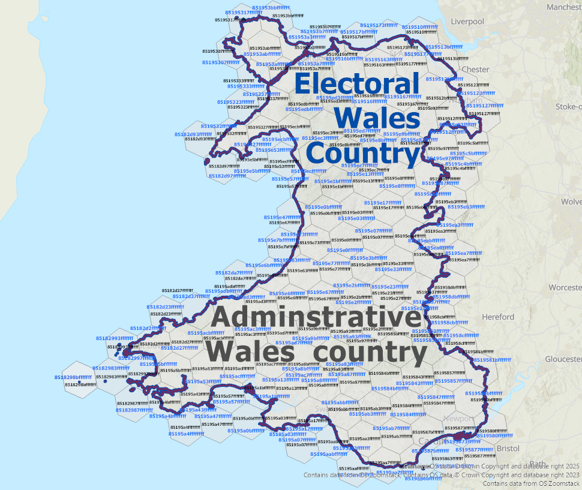

# Algorithm 2: Spatial Relationship Computation

This documents the logic for identifying 17 qualitative spatial relationships (Topological, Proximity, and Hierarchical) across heterogeneous hierarchies.

---

## 1. Relationship Taxonomy
The framework categorizes interactions into three primary domains:
* **Topological**: Identical, Complete Containment, Touch, Intersect, Overlap, Disjoint.
* **Proximity**: Neighbour (d=1), Close (d=2), Near (d=3,4), Far (d≥5), Far Away (d=-1).
* **Hierarchical**: Direct Parent (Complete/Partial), Ancestor (Complete/Partial), Hierarchical Touch, Hierarchical Overlap.

---

## 2. Classification Logic (Pseudocode)
1. **Resolution Check**: Compare H3 resolutions ($r_i, r_j$) of the two feature representations.
2. **Same Resolution Path** ($r_i = r_j$):
    * Perform **Set Intersection** on H3 cell sets to find shared cells ($S$).
    * **Touch**: If overlap ratio $\rho \le 5\%$ and shared cells are on the boundary.
    * **Intersect**: If overlap ratio $\rho \le 10\%$.
    * **Overlap**: If overlap ratio $\rho > 10\%$.
    * If sets are disjoint, compute minimum **H3 grid distance** ($d$).
    * Assign Proximity label: **Neighbour** ($d=1$), **Close** ($d=2$), **Near** ($d=3,4$), or **Far** ($d \ge 5$).
3. **Different Resolution Path** ($r_i \neq r_j$):
    * Map the finer-resolution cells to the coarser resolution ($r_c$) using `h3SetToParent`.
    * Validate containment via **geometric union check** to distinguish between *Complete* and *Partial*.
    * Check alignment with the coarser feature's **border cells** to identify *Hierarchical Touch*.

---

## 3. Results
This set-theoretic approach, replacing traditional vector-based DE-9IM intersection tests, achieved a **3.6x computational speedup** while identifying 11 relationship types not natively supported by traditional topology.

## 4. Illustrative Examples from the Welsh Case Study

The following examples demonstrate the classification logic applied to real geographic data from the Welsh administrative, electoral, and postal hierarchies.

### Topological Relationship: Identical
Demonstrates spatial equivalence across different hierarchies (administrative vs electoral) at H3 Resolution 5.

---

### Proximity Relationship: Near (d = 3–4)
Illustrates qualitative proximity based on H3 grid distance. In this example, the minimum H3 grid distance between feature sets is four cells.

---

### Hierarchical Relationship: Direct Parent (Complete Containment)
Shows how finer-resolution H3 cells representing the CF23 postal sector (resolution 8) are fully contained within the coarser Cardiff administrative boundary (resolution 7).

---

### Edge Case: Direct Parent (Partial Containment)
Due to the discrete nature of the H3 grid, a small number of child cells may extend slightly beyond the exact geometric boundary of the parent feature. This reflects grid approximation rather than a classification error.

