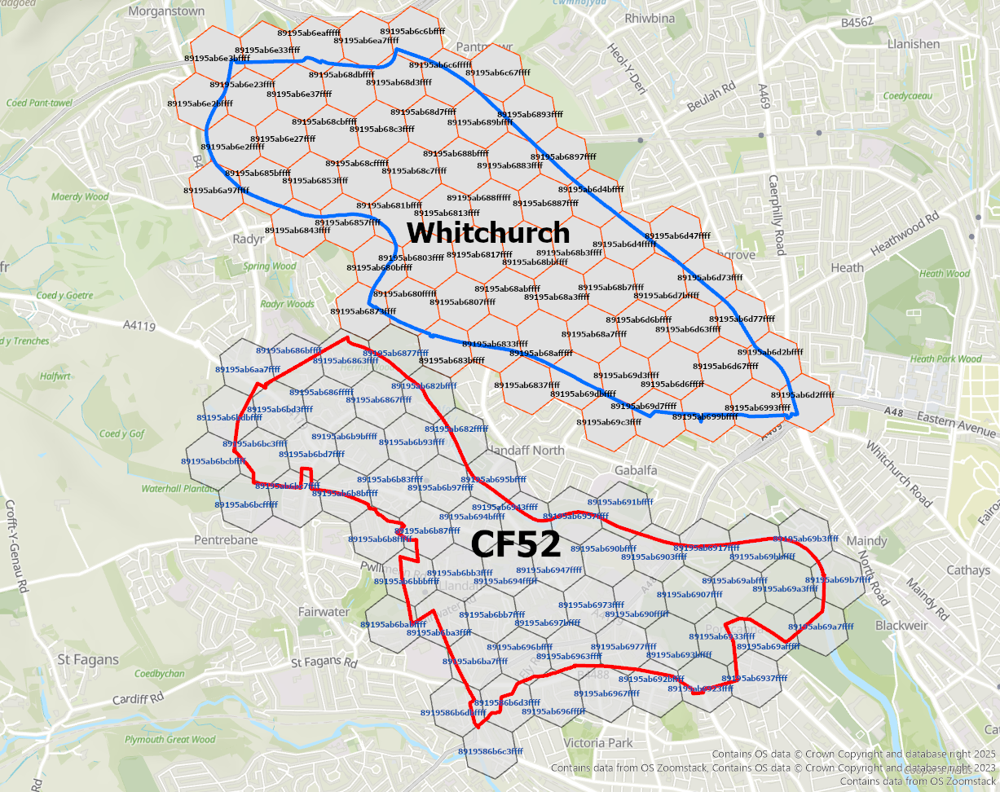
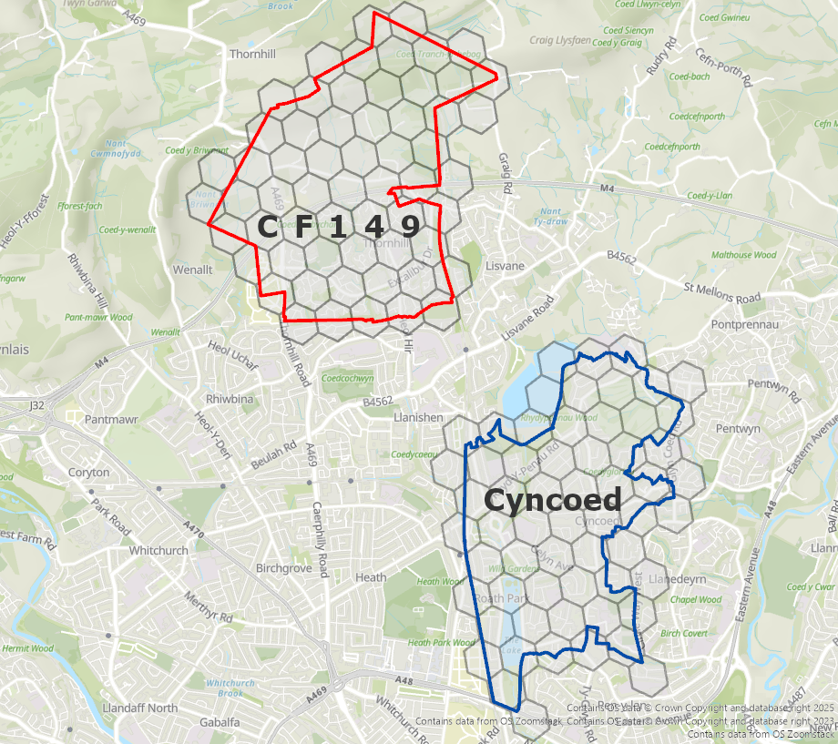
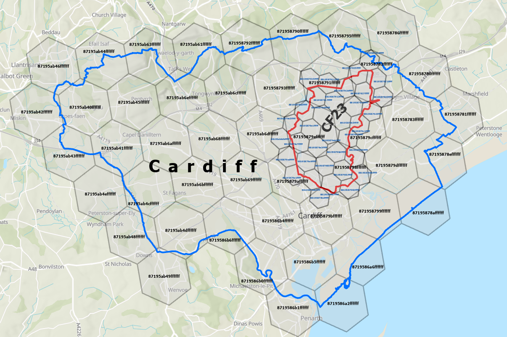
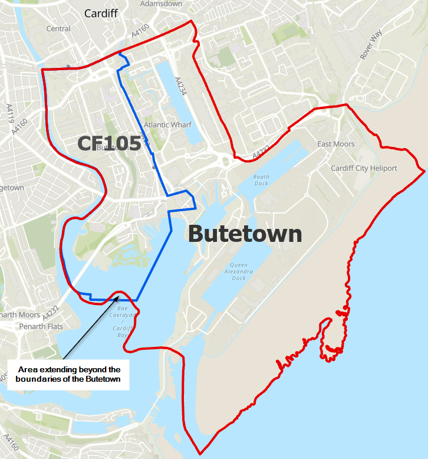
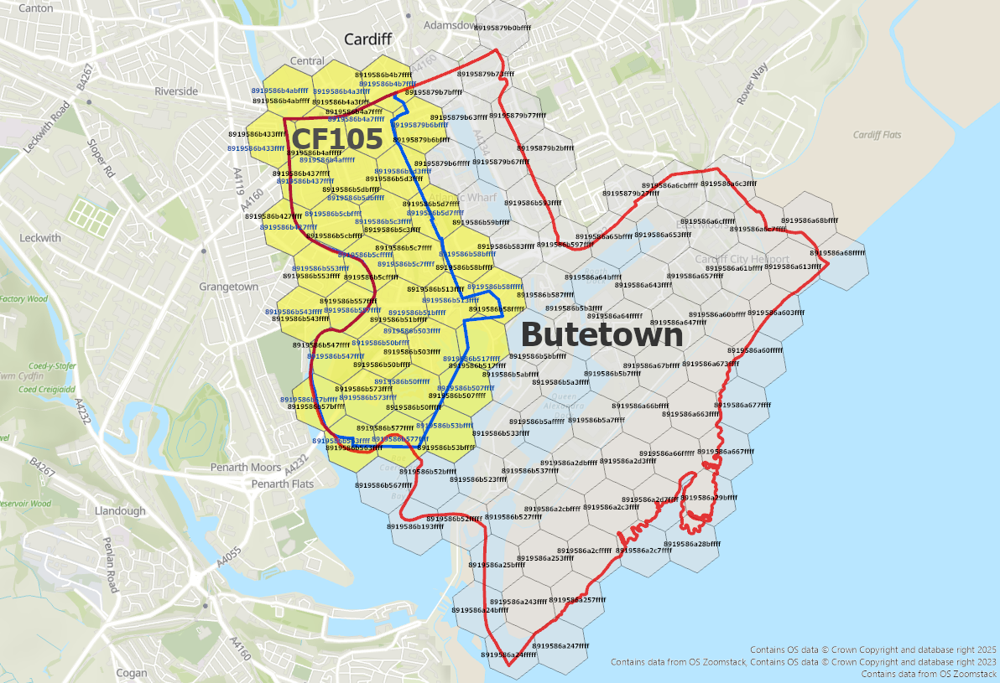
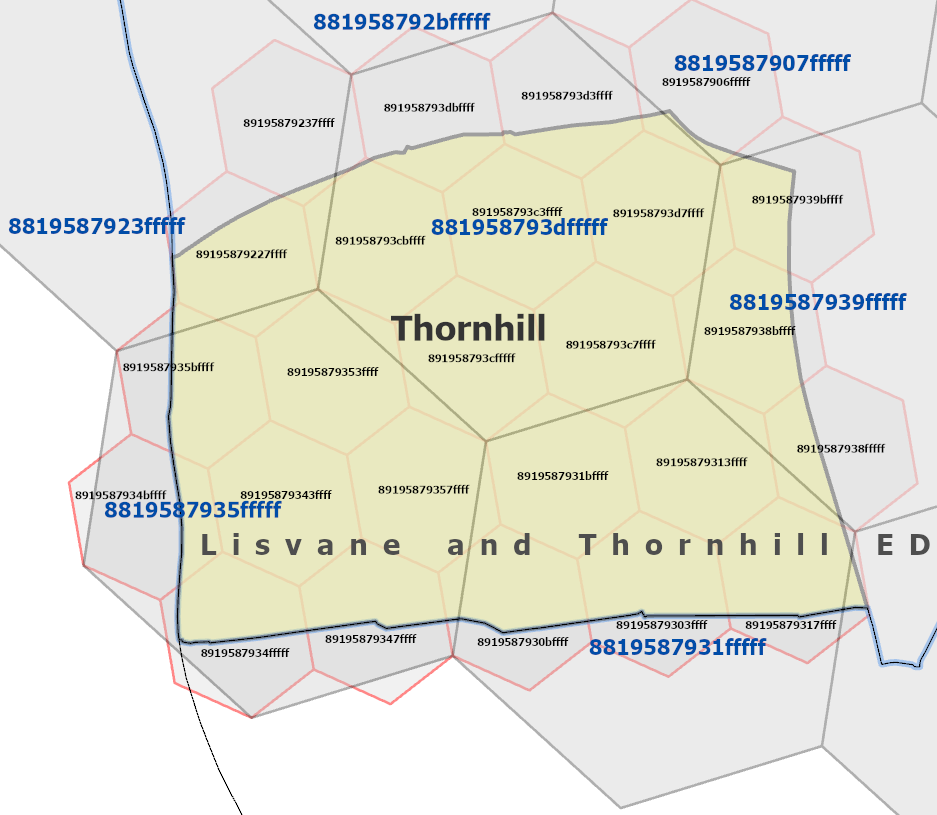
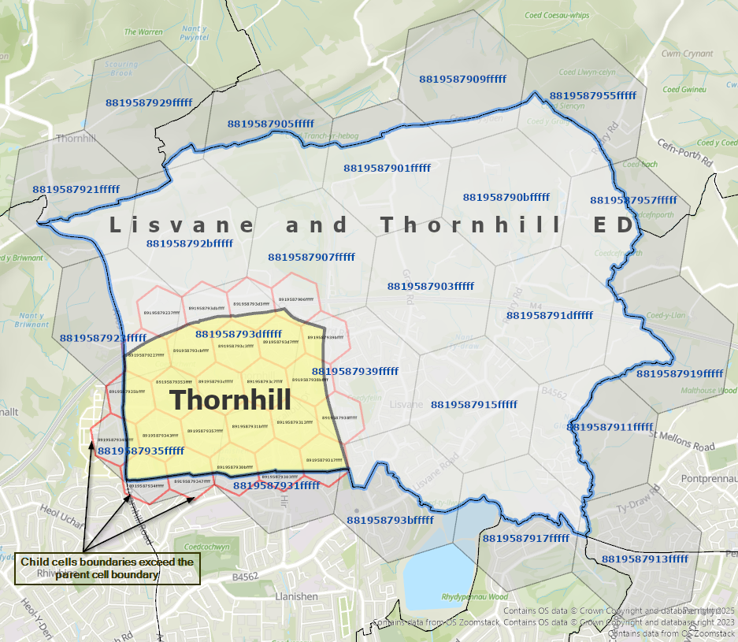

# Algorithm 2: Spatial Relationship Computation

This document details the classification logic used to identify 17 qualitative spatial relationships across heterogeneous geographic hierarchies.

## 1. Metric Logic
The degree of intersection between two H3 cell sets (A and B) is characterized by the **overlap ratio** ρ:
$$\rho = \frac{|A \cap B|}{\min(|A|, |B|)}$$
where 0 ≤ ρ ≤ 1.

## 2. The 17 Spatial Relationships
The framework categorizes interactions into three primary domains:

### Topological (Same Resolution)
1. **Identical**: Cell sets are equal.
2. **Complete Containment**: One set is a proper subset of another.
3. **Touch**: Shared cells with ρ ≤ 0.05.
4. **Intersect**: Shared cells with ρ ≤ 0.10.
5. **Overlap**: Shared cells with ρ > 0.10.
6. **Disjoint**: No shared cells or adjacency.

### Proximity (Same Resolution)
Based on grid distance d:
7. **Neighbour**: d = 1.
8. **Close**: d = 2.
9. **Near**: d ∈ {3, 4}.
10. **Far**: d ≥ 5.
11. **Far Away**: d = -1 (Undefined grid distance).

### Hierarchical (Different Resolution)
Uses parent-mapping (e.g., cell_to_parent):
12. **Direct Parent, Complete**: Finer unit fully geometrically contained by adjacent coarser resolution.
13. **Direct Parent, Partial**: Finer unit partially aligned to parent cells with boundary extension.
14. **Ancestor, Complete**: Full containment at non-adjacent resolution.
15. **Ancestor, Partial**: Partial containment at non-adjacent resolution.
16. **Hierarchical Touch**: Overlap limited to the boundary cells of the coarser unit.
17. **Hierarchical Overlap**: Overlap extending to the interior cells of the coarser unit.

## 3. Technical Reference
For the full methodology and results, refer to Section 3 of the **[Technical Report](../documentation/H3_Relationships_computation_papers.pdf)**.

---

### Proximity Relationship: Near (d = 3–4)
Illustrates qualitative proximity based on H3 grid distance. In this example, the minimum H3 grid distance between feature sets is four cells.

---

### Hierarchical Relationship: Direct Parent (Complete Containment)
Shows how finer-resolution H3 cells representing the CF23 postal sector (resolution 8) are fully contained within the coarser Cardiff administrative boundary (resolution 7).

---
### Hierarchical Relationship: Complete Containment (Cross-Hierarchy Alignment)

This example demonstrates how the H3-based representation can reconcile
minor geometric inconsistencies between heterogeneous spatial datasets.

In the original vector geometries, the CF105 postal sector extends slightly
beyond the Butetown community boundary along the southern coastline.
However, after mapping both features to the H3 grid, all CF105 cells fall
within the H3 representation of Butetown.

As a result, the framework classifies the relationship as **Complete
Containment** in the discretised spatial model.

### Hierarchical Relationship: Direct Parent (Partial Containment)
**Example: Lisvane and Thornhill ED / Thornhill Community**
As documented in the research appendix (Section F.10), a **Partial Containment** relationship is identified when the child H3 cell set is not fully contained within the parent's hexagonal representation. This example illustrates the limit of grid approximation where the geometric discrepancy is significant enough to be preserved in the qualitative output.

